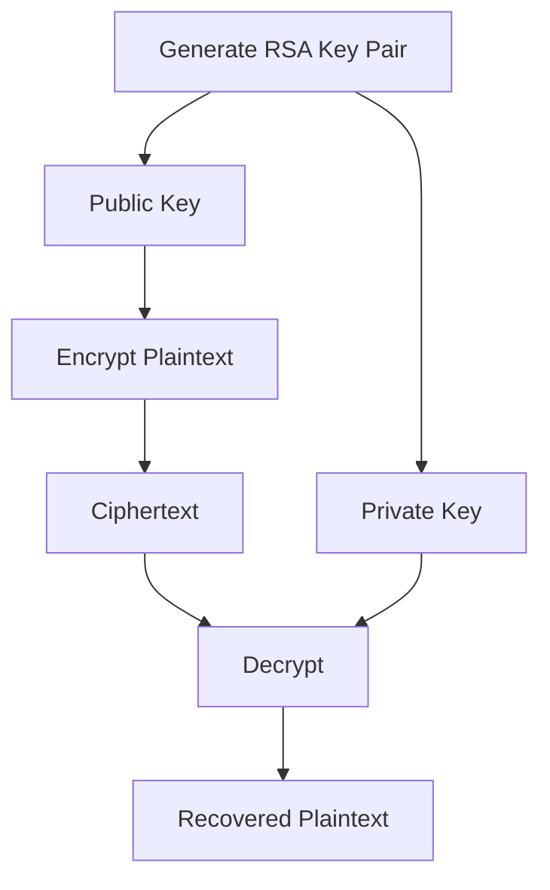

# Cryptography Fundamentals for Security Engineers

> A hands-on Security Engineering project demonstrating the implementation of modern cryptographic techniques using OpenSSL and GnuPG. This project explores symmetric and asymmetric encryption, RSA key management, secure file encryption, and hybrid cryptographic concepts through practical laboratory exercises.

---

# Project Overview

Modern applications depend on cryptography to secure sensitive information during storage and transmission. As a Security Engineer, understanding how encryption algorithms operate, how keys are managed, and how cryptographic tools are implemented is essential for designing secure systems.

In this project, I explored both **symmetric** and **asymmetric cryptography**, implemented secure encryption workflows using **OpenSSL** and **GNU Privacy Guard (GPG)**, generated RSA key pairs, encrypted and decrypted files, inspected cryptographic key structures, and examined how modern systems combine multiple cryptographic techniques to provide **confidentiality**, **integrity**, **authenticity**, and **non-repudiation**.

All activities were performed within a controlled Linux laboratory environment using industry-standard cryptographic utilities.

---

# Objectives

- Understand modern cryptographic principles
- Compare symmetric and asymmetric encryption
- Implement secure file encryption
- Generate and inspect RSA key pairs
- Encrypt and decrypt files using OpenSSL
- Encrypt and decrypt files using GPG
- Understand hybrid cryptography
- Explore secure key management practices
- Strengthen practical Linux security skills

---

# Technologies & Tools

| Category | Technologies |
|----------|--------------|
| Operating System | Kali Linux |
| Cryptography Toolkit | OpenSSL |
| Encryption Utility | GnuPG (GPG) |
| Algorithms | AES-256, CAMELLIA256, RSA-2048 |
| Key Derivation | PBKDF2 |
| Shell | Bash |

---

# Skills Demonstrated

- Security Engineering
- Cryptographic Engineering
- Linux Security
- OpenSSL Administration
- RSA Key Management
- Symmetric Encryption
- Asymmetric Encryption
- Secure File Protection
- Encryption Key Lifecycle
- CLI Security Operations

---

# Security Concepts Covered

## Symmetric Encryption

Symmetric encryption protects data using a single shared secret key for both encryption and decryption. It offers exceptional performance and is widely used to secure files, databases, VPN tunnels, and TLS sessions after key negotiation.

During this project, I explored the following symmetric encryption algorithms:

- AES
- DES
- 3DES
- Camellia
- Blowfish
- Twofish
- IDEA

I also learned why **AES** has become the global encryption standard due to its strong security and excellent performance.

---

## DES vs AES

| DES | AES |
|------|------|
| Published in 1977 | Published in 2001 |
| 56-bit key | 128, 192, or 256-bit keys |
| Vulnerable to brute-force attacks | Industry standard |
| Deprecated | Recommended |

---

## Block vs Stream Ciphers

### Block Cipher

Processes fixed-size blocks of plaintext.

**Examples**

- AES
- Camellia
- Twofish

### Stream Cipher

Encrypts data one byte at a time.

**Common Use Cases**

- Real-time communication
- Voice traffic
- Streaming protocols

---

# Project Architecture


---

# Practical Implementation

## Encrypting Files with GPG

Generated encrypted files using symmetric encryption.

```bash
gpg --symmetric --cipher-algo AES256 message.txt
```

Generated an ASCII-armored encrypted file.

```bash
gpg --armor --symmetric --cipher-algo AES256 message.txt
```

Decrypted the encrypted file.

```bash
gpg --output message.txt --decrypt message.txt.gpg
```

---

## Encrypting Files with OpenSSL

Encrypted files using AES-256-CBC.

```bash
openssl aes-256-cbc -e -in message.txt -out encrypted_message
```

Decrypted encrypted files.

```bash
openssl aes-256-cbc -d -in encrypted_message -out original_message.txt
```

---

## Password-Based Key Derivation

Improved password-derived encryption by using **PBKDF2**.

```bash
openssl aes-256-cbc \
-pbkdf2 \
-iter 10000 \
-e \
-in message.txt \
-out encrypted_message
```

Using PBKDF2 with multiple iterations significantly improves resistance against brute-force attacks.

---

# Asymmetric Cryptography

Unlike symmetric encryption, asymmetric cryptography removes the requirement for a pre-shared secret key by introducing mathematically related key pairs.

Each participant owns:

- Public Key
- Private Key

The **public key** is freely distributed.

The **private key** remains secret.

---

# RSA Workflow



---

# RSA Key Generation

Generated a 2048-bit RSA private key.

```bash
openssl genrsa -out private-key.pem 2048
```

Extracted the public key.

```bash
openssl rsa \
-in private-key.pem \
-pubout \
-out public-key.pem
```

Inspected the RSA key.

```bash
openssl rsa \
-in private-key.pem \
-text \
-noout
```

Reviewed the following RSA parameters:

- Modulus
- Public Exponent
- Private Exponent
- Prime 1
- Prime 2

This exercise improved my understanding of how RSA keys are internally structured.

---

# Encrypting Data with RSA

Encrypted plaintext using the recipient's public key.

```bash
openssl pkeyutl \
-encrypt \
-in plaintext.txt \
-out ciphertext \
-inkey public-key.pem \
-pubin
```

Recovered the plaintext using the private key.

```bash
openssl pkeyutl \
-decrypt \
-in ciphertext \
-inkey private-key.pem \
-out plaintext.txt
```

This demonstrated how asymmetric encryption enables confidential communication without requiring both parties to exchange a shared secret beforehand.

---

# Hybrid Cryptography

Modern secure communication combines symmetric and asymmetric encryption.

Asymmetric cryptography securely exchanges encryption keys, while symmetric cryptography encrypts the actual communication because it is significantly faster.


This hybrid architecture forms the foundation of secure communication protocols such as **HTTPS**.

---

# Validation & Practical Exercises

Successfully completed the following cryptographic exercises:

- Encrypting files using GPG
- Encrypting files using OpenSSL
- Decrypting AES-encrypted files
- Generating RSA key pairs
- Extracting RSA public keys
- Inspecting RSA private key parameters
- Recovering encrypted messages
- Identifying RSA prime values
- Comparing symmetric and asymmetric encryption workflows

These activities reinforced practical cryptographic operations commonly used in Security Engineering.

---

# Security Engineering Takeaways

- AES remains the preferred industry standard for symmetric encryption.
- RSA enables secure communication without pre-shared secret keys.
- PBKDF2 strengthens password-derived encryption keys against brute-force attacks.
- Symmetric encryption provides high performance for bulk data encryption.
- Asymmetric encryption solves secure key distribution challenges.
- Hybrid cryptography combines the advantages of symmetric and asymmetric encryption.
- Effective cryptography depends on proper key management as much as strong algorithms.

---

# Challenges Encountered

- Understanding the operational differences between symmetric and asymmetric encryption.
- Interpreting RSA key parameters generated by OpenSSL.
- Selecting secure encryption modes and password derivation methods.
- Applying cryptographic operations through Linux command-line tools.

---

# Lessons Learned

This project strengthened my understanding of how cryptographic systems protect modern applications. Beyond learning the theory behind encryption algorithms, I gained practical experience using OpenSSL and GnuPG to perform encryption, decryption, key generation, and key inspection. These exercises reinforced the importance of selecting strong cryptographic algorithms, protecting private keys, and combining symmetric and asymmetric encryption techniques to build scalable and secure communication systems.

---

# Disclaimer

> **Disclaimer:** This project was completed within an authorized training and laboratory environment for educational purposes. All cryptographic implementations, key generation, encryption, decryption, and security validation activities were performed on intentionally created lab resources and do not target or expose real-world systems or sensitive information.
