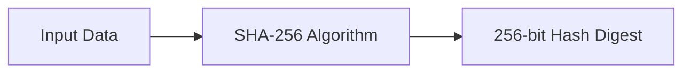
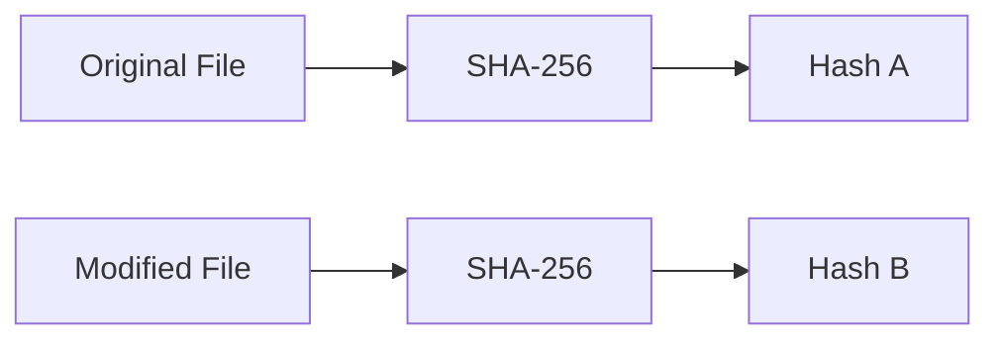
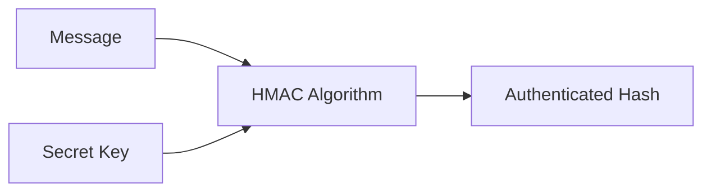

# Hashing, HMAC & Secure Password Storage

> A hands-on Security Engineering project focused on cryptographic hashing, message authentication, file integrity verification, and secure password storage practices. This project explores SHA-256 hashing, HMAC generation, password salting, password cracking demonstrations, and industry-recommended approaches for protecting credentials against modern attack techniques.

---

# Project Overview

Cryptographic hash functions are fundamental components of modern cybersecurity systems. They are widely used for password storage, integrity verification, digital signatures, authentication systems, and secure communication protocols.

In this project, I explored the practical application of cryptographic hash functions using Linux command-line tools, generated SHA-256 checksums, analyzed how small modifications affect hash outputs, implemented HMAC authentication mechanisms, investigated password hashing weaknesses, and demonstrated why salting and modern password storage techniques are essential for defending against credential attacks.

Additionally, I performed practical exercises involving file integrity validation and password hash cracking to understand how weak password storage mechanisms can be exploited by attackers.

All activities were conducted within an authorized Security Engineering laboratory environment.

---

# Objectives

- Understand cryptographic hash functions
- Generate SHA-256 hashes
- Verify file integrity using checksums
- Analyze hash sensitivity to data modifications
- Understand hash collisions
- Generate HMAC values
- Explore password hashing concepts
- Understand password salting
- Demonstrate password cracking techniques
- Study secure password storage best practices

---

# Technologies & Tools

| Category | Technology |
|----------|------------|
| Operating System | Kali Linux |
| Hashing Utility | SHA-256 |
| Authentication | HMAC |
| Password Cracking | Hashcat |
| Shell | Bash |
| Security Tools | OpenSSL, Hashcat |

---

# Skills Demonstrated

- Security Engineering
- Cryptographic Hashing
- File Integrity Verification
- HMAC Authentication
- Password Security
- Password Auditing
- Hash Analysis
- Linux Security Operations
- Credential Protection
- Security Testing

---

# Introduction to Cryptographic Hashing

A cryptographic hash function accepts data of any size and produces a fixed-length output known as a hash, checksum, or message digest.

Unlike encryption algorithms, hash functions are designed to be one-way operations.

A secure hash function should:

- Produce deterministic results
- Be computationally efficient
- Resist collisions
- Resist preimage attacks
- Exhibit avalanche effects

Even a single-bit change in the original data should generate a completely different output hash.

---

# Understanding SHA-256

SHA-256 (Secure Hash Algorithm 256) is one of the most widely used cryptographic hash functions.

Characteristics:

- Output Length: 256 bits
- Digest Size: 32 bytes
- Representation: 64 hexadecimal characters

Regardless of whether the input file is a few bytes or several gigabytes, SHA-256 always generates a fixed-length digest.

---

# SHA-256 Workflow



---

# Practical Implementation

## Generating SHA-256 Checksums

Generated SHA-256 hashes using the Linux `sha256sum` utility.

```bash
sha256sum order.json
```

Output:

```text
2c34b68669427d15f76a1c06ab941e3e6038dacdfb9209455c87519a3ef2c660
```

This checksum uniquely represented the contents of the file at the time of calculation.

---

# File Integrity Verification

Hash functions provide an efficient mechanism for detecting unauthorized modifications.

After modifying the contents of the file, a new checksum was generated.

```bash
sha256sum order.json
```

Modified Output:

```text
11faeec5edc2a2bad82ab116bbe4df0f4bc6edd96adac7150bb4e6364a238466
```

Although only a single field was modified within the file, the resulting checksum changed completely.

This demonstrates the avalanche effect exhibited by secure cryptographic hash functions.

---

# Avalanche Effect

One of the most important properties of secure hash functions is the avalanche effect.

A very small modification to input data results in a dramatically different hash output.



Even if the two files differ by only a single character, Hash A and Hash B will be completely different.

---

# Common Cryptographic Hash Algorithms

Modern secure hash algorithms include:

- SHA-224
- SHA-256
- SHA-384
- SHA-512
- RIPEMD-160

Algorithms considered cryptographically broken include:

- MD5
- SHA-1

These algorithms are vulnerable to collision attacks and should not be used for modern security implementations.

---

# Hash Collisions

A hash collision occurs when two different inputs produce the same hash value.

Collision resistance is a critical requirement for secure cryptographic hash functions.

When collisions become practical, attackers may create malicious files that produce the same checksum as legitimate files, defeating integrity verification mechanisms.

This weakness is one of the reasons MD5 and SHA-1 are no longer considered secure for modern applications.

---

# HMAC (Hash-based Message Authentication Code)

While cryptographic hash functions provide **data integrity**, they do not verify the identity of the sender.

To solve this limitation, **Hash-based Message Authentication Code (HMAC)** combines a cryptographic hash function with a **secret key** to provide both **integrity** and **authenticity**.

Unlike a standard hash, an HMAC can only be generated and verified by parties that possess the shared secret key.

---

# HMAC Workflow



---

# How HMAC Works

HMAC combines:

- A secret key
- An inner padding value (ipad)
- An outer padding value (opad)
- A cryptographic hash function

The HMAC algorithm performs two hashing operations:

1. The secret key is combined with the inner pad and the message.
2. The resulting digest is combined with the outer pad and hashed again.

This process ensures that attackers cannot generate a valid HMAC without knowing the shared secret key.

---

# Practical HMAC Generation

Generated a SHA-256 HMAC using the secret key **3RfDFz82**.

```bash
hmac256 3RfDFz82 order.txt
```

Output:

```text
c7e4de386a09ef970300243a70a444ee2a4ca62413aeaeb7097d43d2c5fac89f
```

The resulting digest verified both:

- Message Integrity
- Message Authenticity

---

# Password Security

One of the most important applications of cryptographic hashing is secure password storage.

Instead of storing passwords in plaintext, modern systems store only cryptographic hashes.

Example:

| Username | Password |
|----------|----------|
| alice | qwerty |
| bob | dragon |
| charlie | princess |

Storing passwords this way is extremely insecure because anyone who gains database access immediately knows every user's credentials.

A more secure approach stores only password hashes.

---

# Password Hashing

Instead of storing plaintext passwords:

```
password123
```

Applications store:

```
Hash(password123)
```

During login:

1. User enters password.
2. Server hashes the entered password.
3. Newly generated hash is compared with the stored hash.
4. Access is granted only if both hashes match.

The original password is never stored.

---

# Rainbow Tables

Although hashing improves password security, weak hashing algorithms remain vulnerable to **Rainbow Table attacks**.

A rainbow table is a precomputed database of common passwords and their corresponding hashes.

Attackers simply search the table instead of computing hashes repeatedly.

Example:

| Password | MD5 Hash |
|-----------|----------|
| qwerty | d8578edf8458ce06fbc5bb76a58c5ca4 |
| dragon | 8621ffdbc5698829397d97767ac13db3 |

This makes unsalted password hashes highly vulnerable.

---

# Password Salting

A **salt** is a randomly generated value added to a password before hashing.

Instead of computing:

```
Hash(password)
```

Modern systems compute:

```
Hash(password + salt)
```

Example:

| Username | Password Hash | Salt |
|----------|---------------|------|
| alice | 8a43db01d06107fcad32f0bcfa651f2f | 12742 |
| bob | aab2b680e6a1cb43c79180b3d1a38beb | 22861 |
| charlie | 3a40d108a068cdc8e7951b82d312129b | 16056 |

Even if two users choose the same password, their hashes will be completely different because each salt is unique.

Salting effectively defeats rainbow table attacks.

---

# Password Storage Workflow


---

# PBKDF2

Password-Based Key Derivation Function 2 (PBKDF2) further strengthens password storage.

Instead of hashing a password only once, PBKDF2 performs hundreds of thousands of iterations before producing the final hash.

Benefits include:

- Slows brute-force attacks
- Increases computational cost for attackers
- Improves password security
- Widely supported across operating systems and applications

PBKDF2 remains one of the recommended password hashing techniques alongside modern algorithms such as bcrypt, scrypt, and Argon2.

---

# Password Cracking Demonstration

To understand the risks of weak password storage, I performed a controlled password auditing exercise using **Hashcat**.

The target MD5 hash:

```text
3fc0a7acf087f549ac2b266baf94b8b1
```

Command used:

```bash
hashcat -m 0 hash.txt /usr/share/wordlists/rockyou.txt
```

Recovered password:

```text
qwerty123
```

This demonstration highlighted how weak passwords protected by outdated hashing algorithms can be recovered rapidly using publicly available wordlists.

---

# Validation & Practical Exercises

Completed the following practical exercises:

- Generated SHA-256 checksums
- Verified file integrity
- Observed avalanche effects
- Compared file hashes before and after modification
- Generated SHA-256 HMAC values
- Studied HMAC authentication workflows
- Analyzed password hashing techniques
- Evaluated rainbow table attacks
- Implemented password salting concepts
- Demonstrated password auditing with Hashcat
- Investigated secure password storage mechanisms

These exercises reinforced the role of hashing in authentication, integrity verification, and credential protection.

---

# Security Engineering Takeaways

- Cryptographic hash functions provide data integrity.
- SHA-256 remains a widely trusted hashing algorithm.
- HMAC provides both integrity and message authentication.
- Even a one-byte modification completely changes a secure hash.
- MD5 and SHA-1 should not be used for modern password storage.
- Password salting defeats rainbow table attacks.
- PBKDF2 significantly increases resistance to brute-force attacks.
- Strong passwords and secure hashing algorithms are equally important.
- Password auditing helps identify weak credentials before attackers exploit them.

---

# Challenges Encountered

- Understanding the distinction between encryption and hashing.
- Differentiating integrity verification from authentication.
- Interpreting HMAC generation workflows.
- Understanding why unsalted password hashes remain vulnerable.
- Demonstrating password recovery using controlled auditing tools.

---

# Lessons Learned

This project provided practical experience implementing cryptographic hashing and secure password storage techniques commonly used in modern Security Engineering. I generated SHA-256 checksums, verified file integrity, produced HMAC values, analyzed password hashing strategies, and demonstrated the importance of salting and key derivation functions. The Hashcat exercise further emphasized how weak passwords and outdated hashing algorithms can be exploited, reinforcing the need for modern password storage practices.

---

# Disclaimer

> **Disclaimer:** This project was completed within an authorized training and laboratory environment for educational purposes. All hashing operations, password auditing activities, HMAC generation, and security testing were performed using intentionally created lab resources. No unauthorized systems, credentials, or production environments were targeted or accessed.
