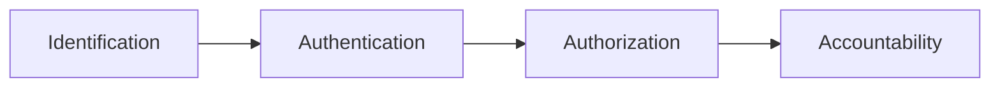
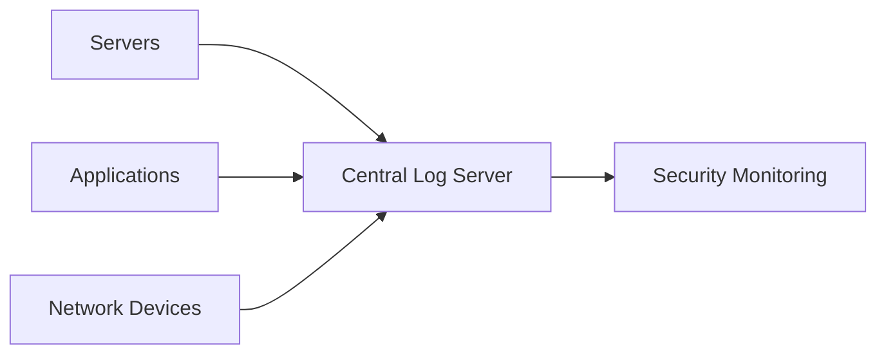
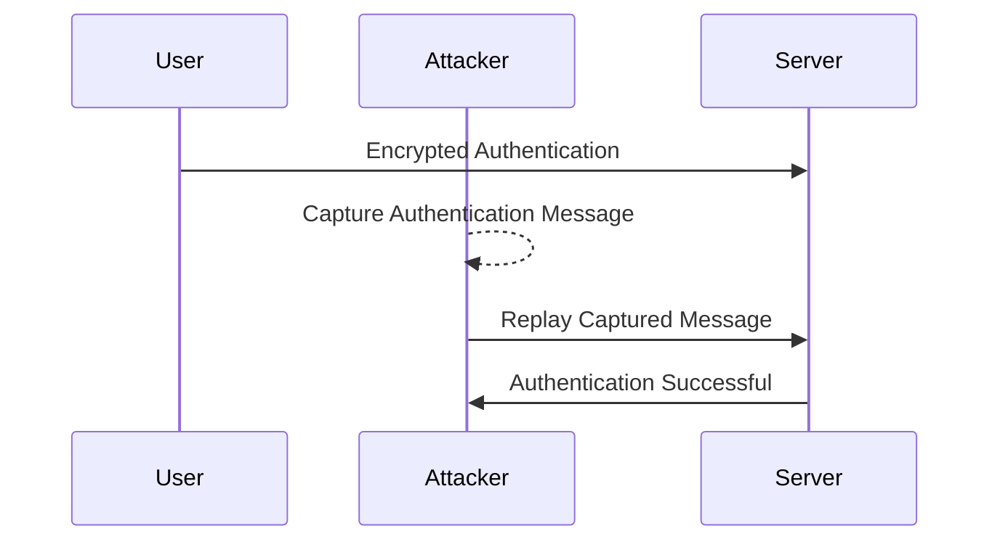
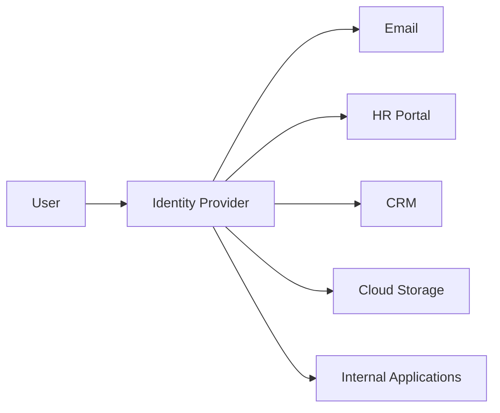

# Identity & Access Management (IAM) Fundamentals for Security Engineers

> A hands-on Security Engineering project exploring Identity and Access Management (IAM), the IAAA security model, authentication mechanisms, access control models, identity governance, and secure authentication practices. This project demonstrates how organizations establish digital identities, enforce access control, protect sensitive resources, and maintain accountability through modern Identity and Access Management principles.

---

# Project Overview

Identity and Access Management (IAM) is one of the most critical domains in Security Engineering. Every secure system must answer four fundamental questions:

- Who is requesting access?
- Can their identity be verified?
- What resources are they permitted to access?
- Can their actions be traced afterward?

These questions are answered through the **Identification, Authentication, Authorization, and Accountability (IAAA)** model.

In this project, I explored the complete lifecycle of digital identity management, from user identification and authentication to authorization, auditing, access control, and identity governance. I also examined common authentication weaknesses, replay attacks, access control models, and modern enterprise technologies such as Multi-Factor Authentication (MFA) and Single Sign-On (SSO).

All activities were performed within an authorized Security Engineering laboratory environment for educational purposes.

---

# Objectives

- Understand Identity and Access Management (IAM)
- Explore the IAAA security model
- Differentiate identification from authentication
- Study authentication factors
- Implement Multi-Factor Authentication concepts
- Understand authorization and access control
- Explore accountability through logging
- Analyze replay attacks
- Understand Identity Management (IdM)
- Compare access control models
- Explore Single Sign-On (SSO)
- Strengthen Security Engineering knowledge

---

# Technologies & Concepts

| Category | Technologies / Concepts |
|------------|--------------------------|
| Operating System | Kali Linux |
| Authentication | Passwords, MFA, Biometrics |
| Identity Services | Identity Management (IdM) |
| Access Management | Identity & Access Management (IAM) |
| Authentication Standards | Multi-Factor Authentication (MFA), Single Sign-On (SSO) |
| Access Control | DAC, RBAC, MAC |
| Security Monitoring | Logging, SIEM |
| Shell | Bash |

---

# Skills Demonstrated

- Security Engineering
- Identity & Access Management
- Authentication Design
- Authorization Management
- Access Control Implementation
- Identity Governance
- Security Auditing
- Logging & Monitoring
- Authentication Security
- Enterprise Identity Architecture

---

# Introduction to Identity & Access Management

Identity and Access Management (IAM) is the collection of policies, technologies, and procedures used to ensure that only authorized users can access organizational resources.

Rather than focusing solely on passwords, IAM governs the complete lifecycle of digital identities, including:

- User onboarding
- Authentication
- Authorization
- Permission management
- Activity monitoring
- User offboarding

Modern organizations rely on IAM to reduce security risks while maintaining operational efficiency across cloud services, enterprise applications, and internal networks.

---

# The IAAA Security Model

The foundation of Identity and Access Management is the **Identification, Authentication, Authorization, and Accountability (IAAA)** model.

Each component performs a specific security function:

| Component | Purpose |
|-----------|---------|
| Identification | Claims an identity |
| Authentication | Verifies the claimed identity |
| Authorization | Determines permitted actions |
| Accountability | Records and audits user activity |

These four stages work together to ensure that access decisions are both secure and traceable.

---

# IAAA Workflow



---

# Identification

Identification is the process by which a user claims an identity.

At this stage, the system simply asks:

> "Who are you?"

The user provides a unique identifier such as:

- Username
- Email address
- Employee ID
- Student ID
- Passport number
- Mobile phone number

Identification does **not** verify whether the claim is legitimate.

Its sole purpose is to uniquely identify an account within the system.

---

# Common Identifiers

Examples include:

- Username
- Corporate email address
- Government-issued identification number
- Student registration number
- Passport number
- Employee identification number

A good identifier should be unique within the environment in which it is used.

---

# Identification vs Authentication

Identification and authentication are often confused, but they perform different functions.

| Identification | Authentication |
|---------------|----------------|
| Claims an identity | Verifies the identity |
| Username | Password |
| Email address | Fingerprint |
| Employee ID | Hardware Token |
| Student Number | One-Time Password |

Identification answers:

> "Who are you?"

Authentication answers:

> "Can you prove it?"

Both processes are required before access can be granted.

---

# Authentication

Authentication is the process of verifying that a user truly owns the identity they claimed during identification.

Authentication protects systems against impersonation and unauthorized access.

Modern authentication mechanisms are typically based on one or more authentication factors.

---

# Authentication Factors

Authentication factors fall into three primary categories.

## Something You Know

Knowledge-based authentication relies on information known only to the user.

Examples include:

- Passwords
- Passphrases
- PINs
- Security questions

This remains the most common authentication method but is vulnerable to phishing, password reuse, and brute-force attacks if used alone.

---

# Something You Have

Possession-based authentication requires ownership of a physical device.

Examples include:

- Smartphone authentication apps
- Hardware security keys
- Smart cards
- OTP generators
- SMS verification codes

Even if an attacker steals a user's password, they cannot authenticate without the physical device.

---

# Something You Are

Biometric authentication verifies physical characteristics unique to the individual.

Examples include:

- Fingerprint recognition
- Facial recognition
- Retina scanning
- Iris recognition
- Voice recognition

Biometric authentication improves usability while providing an additional security layer when combined with other authentication factors.

---

# Multi-Factor Authentication (MFA)

Modern cyberattacks frequently target passwords through phishing, credential stuffing, brute-force attacks, and data breaches. Relying on a single authentication factor is no longer sufficient for protecting sensitive systems.

Multi-Factor Authentication (MFA) strengthens security by requiring users to present two or more independent authentication factors before access is granted.

Because multiple factors are required, compromising one factor alone is generally insufficient for an attacker to gain unauthorized access.

---

# Authentication Factor Categories

Authentication mechanisms are commonly grouped into three categories:

| Factor | Examples |
|---------|----------|
| Something You Know | Password, Passphrase, PIN |
| Something You Have | Smartphone, Hardware Token, Smart Card |
| Something You Are | Fingerprint, Face ID, Iris Scan |

Modern authentication systems combine factors from different categories to improve overall security.

---

# Multi-Factor Authentication Workflow


---

# Common MFA Implementations

Examples of Multi-Factor Authentication include:

- Password + Authenticator Application
- Password + SMS Verification Code
- Password + Hardware Security Key
- Smart Card + PIN
- Fingerprint + PIN
- Facial Recognition + Password

Each additional authentication factor significantly increases the effort required for an attacker to compromise an account.

---

# Two-Factor Authentication (2FA)

Two-Factor Authentication (2FA) is a specific implementation of MFA that requires exactly two independent authentication factors.

Examples include:

- ATM Card + PIN
- Password + One-Time Password (OTP)
- Password + Fingerprint
- Hardware Token + Password

Although 2FA greatly improves security, organizations increasingly deploy MFA with additional verification methods for highly sensitive systems.

---

# Authorization

After successful authentication, the next stage is authorization.

Authorization determines the actions and resources an authenticated user is permitted to access.

Rather than asking:

> "Who are you?"

Authorization asks:

> "What are you allowed to do?"

Access permissions are typically granted according to:

- Organizational role
- Business function
- Security policy
- Least privilege principle
- Job responsibilities

Authorization helps ensure users receive only the permissions required to perform their duties.

---

# Authorization Workflow


---

# Principle of Least Privilege

One of the most important authorization principles is the **Principle of Least Privilege (PoLP)**.

Users should receive only the minimum permissions necessary to complete their assigned tasks.

Benefits include:

- Reduced attack surface
- Lower insider threat risk
- Improved compliance
- Reduced impact of compromised accounts

Restricting unnecessary privileges helps limit the damage caused by both malicious users and compromised credentials.

---

# Accountability

After users have been authenticated and authorized, their activities should be recorded.

This principle is known as **Accountability**.

Accountability ensures users remain responsible for actions performed under their identities.

Typical activities recorded include:

- Successful logins
- Failed authentication attempts
- File access
- Administrative actions
- Permission changes
- Resource usage
- System configuration changes

Maintaining accurate activity records enables organizations to investigate security incidents and demonstrate regulatory compliance.

---

# Logging

Logging is the process of recording security-relevant events within information systems.

Logs provide visibility into:

- User activity
- Authentication attempts
- System events
- Security alerts
- Administrative operations
- Application errors

Proper logging forms the foundation of effective monitoring, incident response, and digital forensics.

---

# Secure Logging Architecture



---

# Log Forwarding

To reduce the risk of attackers tampering with evidence, organizations commonly forward logs from individual systems to centralized logging servers.

Advantages include:

- Centralized monitoring
- Improved log retention
- Protection against local log deletion
- Simplified incident investigations
- Easier compliance reporting

Centralized logging enables security teams to correlate events across multiple systems.

---

# Security Information and Event Management (SIEM)

Security Information and Event Management (SIEM) platforms aggregate logs from diverse systems and analyze them for suspicious activity.

SIEM platforms provide:

- Centralized log collection
- Real-time monitoring
- Threat detection
- Automated alerting
- Incident investigation
- Compliance reporting

Rather than manually reviewing thousands of log files, analysts use SIEM solutions to identify abnormal behavior efficiently.

---

# Identity Management (IdM)

Identity Management (IdM) focuses on creating, maintaining, and managing digital identities throughout their lifecycle.

Typical IdM activities include:

- User provisioning
- Identity verification
- Password management
- Role assignment
- Account lifecycle management
- User deprovisioning

Centralized identity management reduces administrative overhead while improving security consistency across enterprise environments.

---

# Identity Lifecycle


---

# Identity & Access Management (IAM)

Identity & Access Management (IAM) extends Identity Management by governing how identities interact with organizational resources.

IAM integrates multiple security capabilities, including:

- Identity Management
- Authentication
- Authorization
- Access Governance
- Role Management
- Multi-Factor Authentication
- Single Sign-On
- Compliance Monitoring
- User Lifecycle Management

IAM ensures users receive appropriate access while continuously enforcing organizational security policies.

---

# IdM vs IAM

| Identity Management (IdM) | Identity & Access Management (IAM) |
|---------------------------|------------------------------------|
| Creates identities | Governs identity usage |
| Manages user accounts | Controls access decisions |
| Handles provisioning | Enforces organizational policies |
| Focuses on identity lifecycle | Focuses on enterprise-wide access management |

Although closely related, IAM encompasses a broader set of governance and security capabilities than traditional Identity Management alone.

---


# Authentication Protocol Security

Authentication protocols are responsible for verifying user identities before granting access to protected resources. Designing secure authentication protocols is considerably more complex than simply encrypting usernames and passwords.

Even small implementation flaws can introduce vulnerabilities that allow attackers to impersonate legitimate users without ever learning their credentials.

This project explored why modern systems rely on standardized, peer-reviewed authentication protocols instead of custom authentication mechanisms.

---

# The Problem with Naive Authentication

A common misconception is that encrypting a password is enough to secure authentication.

Consider the following workflow:

```text
Client
    │
    │ Encrypt Password
    ▼
Encrypted Password
    │
    ▼
Server
```

Although the password is encrypted during transmission, the authentication response remains identical every time the user logs in.

If an attacker captures this encrypted authentication message, they may simply resend it later to impersonate the legitimate user.

---

# Replay Attack

This attack is known as a **Replay Attack**.

Rather than stealing the user's password, the attacker captures a previously valid authentication request and replays it against the server.

Since the authentication message is still valid, the server incorrectly accepts it.

---

# Replay Attack Workflow



---

# Why Replay Attacks Work

Replay attacks succeed because:

- Authentication messages never change.
- The server cannot distinguish old requests from new ones.
- Authentication lacks freshness validation.
- No mechanism prevents message reuse.

As a result, attackers can authenticate without ever knowing the user's password.

---

# Preventing Replay Attacks

Modern authentication protocols prevent replay attacks by ensuring every authentication exchange is unique.

Common techniques include:

- Nonces
- Timestamps
- Challenge-response authentication
- Session identifiers
- Cryptographic random values

These mechanisms ensure previously captured authentication messages become invalid almost immediately.

---

# Secure Authentication Principles

A secure authentication protocol should provide:

- Identity verification
- Fresh authentication data
- Resistance to replay attacks
- Protection against credential interception
- Cryptographic integrity
- Mutual trust where required

Modern authentication standards incorporate these protections by default.

---

# Access Control Models

Once authentication succeeds, organizations must determine what resources users are permitted to access.

Access Control Models define how permissions are granted and enforced throughout an environment.

This project explored three of the most widely implemented access control models.

---

# Discretionary Access Control (DAC)

Discretionary Access Control allows the owner of a resource to determine who may access it.

The owner explicitly grants permissions to individual users.

Examples include:

- Sharing Google Drive folders
- Sharing Dropbox files
- Granting edit permissions to specific users
- Social media privacy settings

Advantages:

- Flexible
- Easy to understand
- Suitable for small environments

Limitations:

- Difficult to manage at scale
- Increased administrative overhead

---

# Role-Based Access Control (RBAC)

Role-Based Access Control assigns permissions based on organizational roles rather than individual users.

Examples include:

| Role | Typical Permissions |
|------|----------------------|
| HR | Employee records |
| Finance | Financial systems |
| Sales | CRM platform |
| Security | Security tools |
| IT Administrator | Infrastructure management |

Users inherit permissions automatically based on their assigned role.

Benefits include:

- Simplified administration
- Consistent permissions
- Reduced configuration errors
- Improved scalability

RBAC is the most common enterprise access control model.

---

# Mandatory Access Control (MAC)

Mandatory Access Control is the strictest access control model.

Rather than allowing users to modify permissions, the operating system enforces predefined security policies.

Users cannot override these policies.

Examples include:

- SELinux
- AppArmor
- Military environments
- Government systems
- High-security infrastructures

MAC significantly reduces the risk of privilege abuse.

---

# Comparing Access Control Models

| Model | Permission Assignment | Typical Use Case |
|--------|-----------------------|------------------|
| DAC | Resource Owner | Personal sharing |
| RBAC | Organizational Role | Enterprise environments |
| MAC | System Policy | High-security systems |

Selecting the appropriate model depends on organizational requirements, regulatory obligations, and security objectives.

---

# Single Sign-On (SSO)

Large organizations often operate dozens of independent applications.

Without Single Sign-On, users must maintain separate credentials for every system.

Single Sign-On (SSO) allows users to authenticate once and securely access multiple authorized services without repeated logins.

---

# SSO Workflow



---

# Benefits of Single Sign-On

Implementing SSO provides several operational and security advantages:

- Reduced password fatigue
- Stronger password policies
- Simplified password management
- Easier Multi-Factor Authentication deployment
- Improved user productivity
- Centralized authentication
- Lower helpdesk costs
- Better access auditing

Organizations frequently integrate SSO with MFA to provide both convenience and stronger identity protection.

---

# Practical Security Engineering Outcomes

Throughout this project, I examined how enterprise identity systems establish trust, verify identities, enforce authorization policies, and maintain accountability through centralized authentication and auditing.

Key practical areas explored included:

- Understanding secure authentication workflows
- Identifying replay attack weaknesses
- Comparing enterprise access control models
- Evaluating Identity Management (IdM)
- Understanding Identity & Access Management (IAM)
- Studying Multi-Factor Authentication (MFA)
- Exploring Single Sign-On (SSO)
- Understanding centralized logging and SIEM integration
- Applying the Principle of Least Privilege
- Strengthening enterprise identity governance knowledge

---

# Security Engineering Takeaways

- Authentication must verify identity while preventing replay attacks.
- Authorization should always follow the Principle of Least Privilege.
- Accountability depends on comprehensive logging and auditing.
- Centralized Identity Management simplifies enterprise security.
- IAM provides governance across the complete identity lifecycle.
- RBAC significantly improves scalability compared to DAC.
- MAC offers the strongest enforcement for high-security environments.
- MFA substantially reduces account compromise risks.
- SSO improves usability while supporting stronger authentication policies.
- Modern enterprise security depends on integrating identity, authentication, authorization, monitoring, and governance into a unified IAM architecture.

---

# Challenges Encountered

During this project, I strengthened my understanding of:

- Differentiating identification from authentication.
- Understanding enterprise identity lifecycle management.
- Comparing access control models and selecting appropriate use cases.
- Analyzing replay attack weaknesses.
- Understanding centralized logging and SIEM architecture.
- Applying enterprise IAM concepts to real-world security environments.

---

# Lessons Learned

This project expanded my understanding of Identity and Access Management as a foundational component of modern Security Engineering. Beyond learning the theory behind authentication and authorization, I explored how organizations manage digital identities throughout their lifecycle, enforce least privilege, implement secure access control models, detect malicious activity through centralized logging, and strengthen authentication using MFA and SSO. These concepts collectively form the backbone of secure enterprise identity architectures.

---


# Disclaimer

> **Disclaimer:** This project was completed in an authorized training and laboratory environment for educational purposes. All identity management concepts, authentication workflows, access control implementations, logging analysis, and security validation activities were performed using intentionally created lab resources and do not target or expose real-world systems or sensitive organizational data.
