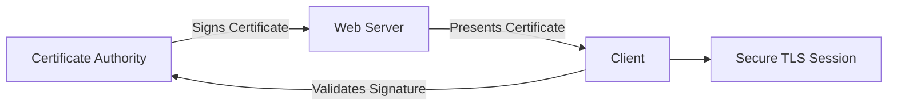
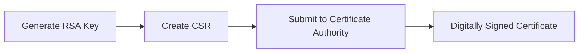
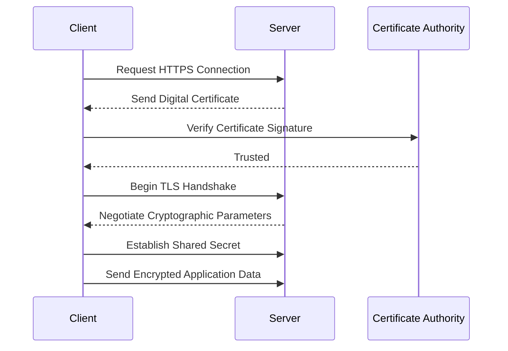
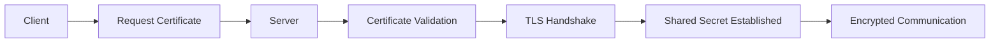

# Public Key Infrastructure (PKI) & TLS

> A hands-on Security Engineering project demonstrating the implementation of Public Key Infrastructure (PKI), digital certificates, Certificate Signing Requests (CSR), self-signed certificates, and TLS concepts using OpenSSL. This project explores how modern systems establish trust, authenticate identities, and secure communications over untrusted networks.

---

# Project Overview

Modern encryption alone cannot guarantee secure communication. While protocols such as Diffie-Hellman establish shared secret keys, they do not verify the identity of the communicating parties. Public Key Infrastructure (PKI) addresses this challenge by providing a trusted framework for identity verification through digital certificates issued by Certificate Authorities (CAs).

In this project, I explored the fundamentals of PKI, generated Certificate Signing Requests (CSR), created self-signed certificates, inspected X.509 certificates using OpenSSL, and analyzed how HTTPS and the TLS handshake protect data transmitted across insecure networks.

All activities were performed within an authorized Security Engineering laboratory environment using Linux and OpenSSL.

---

# Objectives

- Understand Public Key Infrastructure (PKI)
- Understand Certificate Authorities (CA)
- Generate Certificate Signing Requests (CSR)
- Create self-signed certificates
- Inspect X.509 certificates
- Explore TLS authentication
- Understand HTTPS security
- Analyze TLS handshakes
- Validate certificate properties
- Strengthen practical OpenSSL skills

---

# Technologies & Tools

| Category | Technology |
|----------|------------|
| Operating System | Kali Linux |
| Cryptographic Toolkit | OpenSSL |
| Certificate Standard | X.509 |
| Public Key Algorithm | RSA-4096 |
| Security Protocol | TLS |
| Web Security | HTTPS |
| Shell | Bash |

---

# Skills Demonstrated

- Security Engineering
- Public Key Infrastructure
- Certificate Management
- OpenSSL Administration
- TLS Fundamentals
- HTTPS Security
- Certificate Validation
- RSA Key Management
- Digital Trust Models
- Linux Security

---

# Introduction to Public Key Infrastructure

Public Key Infrastructure (PKI) is the trust framework used by modern applications to verify digital identities.

Instead of simply encrypting communications, PKI ensures that users are communicating with legitimate systems rather than attackers impersonating trusted services.

PKI enables:

- Authentication
- Confidentiality
- Integrity
- Trust Establishment
- Secure Identity Verification

Without PKI, encrypted communication would remain vulnerable to impersonation attacks such as Man-in-the-Middle (MITM).

---

# PKI Architecture



---

# Why Certificates Matter

When visiting an HTTPS website, the browser requests the server's digital certificate.

The certificate contains:

- Public Key
- Domain Name
- Organization Information
- Validity Period
- Digital Signature
- Certificate Authority Information

The browser verifies that the certificate was signed by a trusted Certificate Authority before allowing encrypted communication to continue.

---

# Certificate Authorities (CA)

Certificate Authorities are trusted organizations responsible for issuing and digitally signing certificates.

Examples include:

- DigiCert
- GlobalSign
- Sectigo
- Let's Encrypt

Browsers include trusted CA certificates that allow them to verify the authenticity of websites automatically.

---

# Certificate Signing Request (CSR)

A Certificate Signing Request (CSR) contains information about an organization together with its public key.

The CSR is submitted to a Certificate Authority for verification and certificate issuance.

Generate a CSR using OpenSSL:

```bash
openssl req -new -nodes -newkey rsa:4096 \
-keyout key.pem \
-out cert.csr
```

---

# CSR Generation Process

During CSR creation, OpenSSL prompts for identifying information such as:

- Country
- State
- Locality
- Organization
- Organizational Unit
- Common Name
- Email Address

This information becomes part of the certificate request submitted to the Certificate Authority.

---

# CSR Workflow



---

# Creating a Self-Signed Certificate

For testing purposes, a self-signed certificate can be generated without involving a Certificate Authority.

```bash
openssl req \
-x509 \
-newkey rsa:4096 \
-nodes \
-keyout key.pem \
-out cert.pem \
-sha256 \
-days 365
```

Although useful for development and laboratory environments, self-signed certificates are not automatically trusted by browsers.

---

# Inspecting Certificates

Certificates can be inspected using OpenSSL.

```bash
openssl x509 -in cert.pem -text
```

The inspection reveals:

- Certificate Version
- Signature Algorithm
- Issuer
- Subject
- Validity Period
- Public Key
- Extensions
- Digital Signature

---

# RSA Key Validation

Verified the generated RSA private key.

```bash
openssl rsa -in key.pem -text -noout
```

Result:

```text
RSA Private-Key: (4096 bit, 2 primes)
```

This confirmed that a strong 4096-bit RSA key pair had been generated.

---

# Certificate Validation

After inspecting the generated certificate, the validity period was confirmed.

Example:

```
Not Before:
Aug 11 2022

Not After:
Feb 25 2039
```

The certificate remained valid until:

```
2039
```

This exercise demonstrated how OpenSSL exposes certificate metadata for administrative verification.

---

# HTTPS Authentication Workflow

HTTPS combines encryption with authentication to establish secure communication over untrusted networks.

Before sensitive information such as usernames and passwords is transmitted, the client must verify that it is communicating with the legitimate server.

The authentication process follows a structured sequence.

---

# TLS Authentication Process



---

# Step 1 — Certificate Request

When a client connects to a secure website using HTTPS, the first action is requesting the server's digital certificate.

The certificate contains the information necessary for identity verification before encrypted communication begins.

---

# Step 2 — Certificate Delivery

The server responds by sending its X.509 digital certificate.

The certificate includes:

- Public key
- Subject information
- Issuer
- Validity period
- Signature algorithm
- Digital signature
- Certificate extensions

This information allows the client to verify the server's identity.

---

# Step 3 — Certificate Validation

The client verifies the authenticity of the certificate before trusting the connection.

Validation includes checking:

- Certificate Authority signature
- Certificate validity dates
- Domain name
- Certificate integrity
- Certificate trust chain

If validation fails, the browser warns the user that the connection cannot be trusted.

---

# Digital Signature Verification

A Certificate Authority digitally signs every certificate it issues.

The browser verifies this signature by:

1. Calculating a hash of the received certificate.
2. Decrypting the CA's digital signature using the CA's public key.
3. Comparing both hash values.

If both values match, the certificate is considered authentic.

This process ensures the certificate has not been altered and was issued by a trusted Certificate Authority.

---

# TLS Handshake

Once the certificate has been validated, the TLS handshake begins.

During the handshake, the client and server negotiate:

- TLS version
- Cipher suite
- Key exchange algorithm
- Session keys
- Encryption algorithms

A shared secret is then established, allowing all subsequent communication to be encrypted using symmetric cryptography.

---

# TLS Handshake Workflow



---

# Secure Credential Transmission

After the TLS handshake is complete, sensitive information can safely traverse the network.

Examples include:

- Usernames
- Passwords
- Session tokens
- Financial information
- Personal data

Because the connection is encrypted, attackers monitoring network traffic cannot read or modify the transmitted information.

---

# Data in Transit vs Data at Rest

A secure system protects information both while it is being transmitted and while it is stored.

| Protection Area | Technology |
|-----------------|------------|
| Data in Transit | TLS / HTTPS |
| Data at Rest | Password Hashing, Encryption, Salting |

TLS secures information during transmission, while cryptographic hashing and encryption protect stored data against unauthorized access.

---

# Relationship Between PKI and Diffie-Hellman

This project demonstrates how modern secure communication combines multiple cryptographic technologies.

- **Diffie-Hellman** establishes a shared secret.
- **PKI** authenticates communicating parties.
- **TLS** combines both to provide confidentiality, integrity, and authentication.

Together, these mechanisms form the foundation of secure internet communications.

---

# Validation & Practical Exercises

Throughout this project, I completed the following practical exercises:

- Generated RSA-4096 private keys
- Created Certificate Signing Requests (CSR)
- Generated self-signed X.509 certificates
- Inspected certificate metadata using OpenSSL
- Validated certificate properties
- Verified RSA key sizes
- Examined certificate validity periods
- Explored Public Key Infrastructure (PKI)
- Analyzed HTTPS authentication workflows
- Studied the TLS handshake process
- Investigated certificate trust chains
- Compared trusted certificates with self-signed certificates

These exercises strengthened my practical understanding of authentication and trust establishment in modern Security Engineering.

---

# Security Engineering Takeaways

- Encryption alone does not establish trust.
- PKI enables scalable identity verification across the internet.
- Certificate Authorities serve as trusted third parties.
- TLS combines authentication with encryption to secure communications.
- X.509 certificates provide verifiable digital identities.
- Certificate validation protects against impersonation attacks.
- HTTPS relies on both asymmetric and symmetric cryptography.
- Strong certificate management is essential for secure web applications.

---

# Challenges Encountered

- Understanding the trust relationship between browsers and Certificate Authorities.
- Interpreting X.509 certificate fields using OpenSSL.
- Distinguishing between Certificate Signing Requests and issued certificates.
- Understanding how TLS combines multiple cryptographic mechanisms into a single secure protocol.
- Relating Diffie-Hellman key exchange to certificate-based authentication.

---

# Lessons Learned

This project strengthened my understanding of how modern systems establish trust before exchanging sensitive information. By generating RSA key pairs, creating Certificate Signing Requests, producing self-signed certificates, and inspecting X.509 certificate structures with OpenSSL, I gained practical experience implementing Public Key Infrastructure concepts. I also developed a deeper understanding of how HTTPS and the TLS handshake combine authentication, encryption, and certificate validation to secure communications over untrusted networks.

---

# Disclaimer

> **Disclaimer:** This project was completed within an authorized training and laboratory environment for educational purposes. All certificate generation, key management, TLS analysis, and Public Key Infrastructure activities were performed using intentionally created lab resources and did not involve unauthorized access to production systems or third-party infrastructure.
