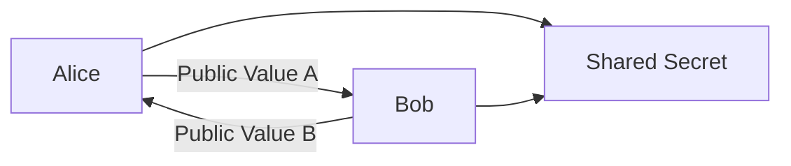
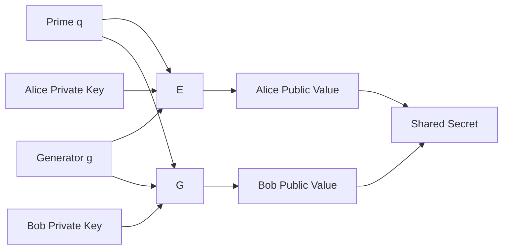

# Secure Key Exchange with Diffie-Hellman

> A hands-on Security Engineering project demonstrating the implementation of the Diffie-Hellman key exchange protocol using OpenSSL. This project explores secure key establishment over untrusted networks, practical parameter generation, protocol security, and the importance of authentication in defending against Man-in-the-Middle (MITM) attacks.

---

# Project Overview

Secure communication depends not only on strong encryption algorithms but also on the ability of communicating parties to establish a shared secret securely. One of the most significant breakthroughs in modern cryptography is the **Diffie-Hellman Key Exchange**, which allows two parties to agree on a common secret over an insecure communication channel.

In this project, I explored the mathematical principles behind the Diffie-Hellman algorithm, generated real-world Diffie-Hellman parameters using OpenSSL, inspected cryptographic parameter files, validated prime sizes, and examined why the protocol alone cannot guarantee authentication.

Additionally, I analyzed how a Man-in-the-Middle (MITM) attack compromises unauthenticated Diffie-Hellman exchanges and why modern secure communication protocols integrate authentication mechanisms alongside key exchange.

All activities were completed within an authorized Security Engineering laboratory environment using OpenSSL and Linux command-line tools.

---

# Objectives

- Understand the purpose of secure key exchange
- Explore the Diffie-Hellman algorithm
- Understand public and private key generation
- Learn how shared secrets are established
- Generate Diffie-Hellman parameters with OpenSSL
- Inspect Diffie-Hellman parameter files
- Validate prime sizes and generators
- Understand the Discrete Logarithm Problem
- Analyze Man-in-the-Middle attacks
- Understand why authentication is required in modern cryptographic protocols

---

# Technologies & Tools

| Category | Technology |
|----------|------------|
| Operating System | Kali Linux |
| Cryptography Toolkit | OpenSSL |
| Shell | Bash |
| Key Exchange Protocol | Diffie-Hellman |
| Cryptographic Concepts | Modular Arithmetic |

---

# Skills Demonstrated

- Security Engineering
- Cryptographic Engineering
- Diffie-Hellman Key Exchange
- OpenSSL Administration
- Linux Security
- Cryptographic Parameter Validation
- Secure Key Establishment
- Cryptographic Analysis
- Threat Modeling
- Network Security Fundamentals

---

# Introduction

Encryption algorithms such as AES require both communicating parties to possess the same secret key before encrypted communication can begin.

The challenge is how two users can establish this shared secret without exposing it to attackers monitoring the communication channel.

The Diffie-Hellman Key Exchange protocol solves this problem by allowing both parties to independently calculate the same shared secret without ever transmitting that secret across the network.

Even if an attacker intercepts every exchanged message, deriving the shared secret remains computationally infeasible when secure parameters are used.

---

# Understanding Diffie-Hellman

The Diffie-Hellman algorithm relies on two publicly known values:

- A large prime number (q)
- A generator (g)

Each participant independently selects a private value.

Using these values, each participant calculates a corresponding public value which is exchanged across the network.

Despite exchanging only public information, both participants ultimately compute the exact same shared secret.

---

# Diffie-Hellman Workflow



---

# Key Exchange Process

## Step 1 — Public Parameters

Both communicating parties first agree on two public values.

- Prime Number (q)
- Generator (g)

These values are not secret and may be transmitted openly.

Example:

```
Prime (q): 29
Generator (g): 3
```

---

## Step 2 — Private Key Selection

Each participant generates a random private number.

Example:

**Alice**

```
Private Key = 13
```

**Bob**

```
Private Key = 15
```

These values never leave their respective systems.

---

## Step 3 — Public Key Generation

Using the agreed parameters, each participant computes a public value.

Alice computes:

```
A = g^a mod q
```

Bob computes:

```
B = g^b mod q
```

Only these public values are exchanged.

---

## Step 4 — Shared Secret Generation

After exchanging public values, both participants independently compute the shared secret.

Alice computes:

```
Shared Secret = B^a mod q
```

Bob computes:

```
Shared Secret = A^b mod q
```

Despite performing different calculations, both obtain the exact same secret key.



---

# Why Diffie-Hellman Is Secure

An attacker monitoring the communication can observe:

- Prime Number
- Generator
- Alice's Public Value
- Bob's Public Value

However, the attacker cannot efficiently recover either participant's private key because doing so requires solving the **Discrete Logarithm Problem**, which becomes computationally infeasible when large cryptographic parameters are used.

Modern implementations typically use prime numbers ranging from **2048 bits** to **4096 bits**, making brute-force recovery impractical with current computing capabilities.

---

# Generating Diffie-Hellman Parameters with OpenSSL

To simulate real-world deployments, I generated Diffie-Hellman parameters using OpenSSL.

Generate a 2048-bit parameter file:

```bash
openssl dhparam -out dhparams.pem 2048
```

Inspect the generated parameters:

```bash
openssl dhparam -in dhparams.pem -text -noout
```

The output exposes:

- Prime Number
- Generator
- Parameter Size

This exercise demonstrates how production systems generate trusted Diffie-Hellman parameters for secure key exchange.
